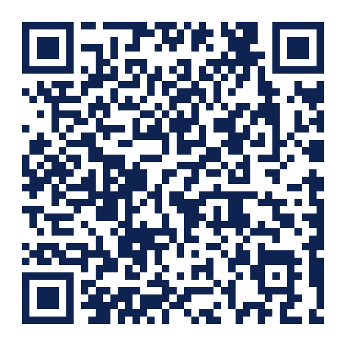

# AirportNav

**Every piece of information in an airport is physical. This app makes it digital.**

Departure boards you have to walk to and squint at. Paper maps bolted to a wall.
Gate changes announced over a speaker you cannot hear. Lounge rules printed on a
door. Today a traveller reconstructs their journey from scattered physical
signage - AirportNav puts all of it in one place, personalised to the flight you
are actually on.

### Try it

**[Open the live demo](https://meitarmatzner16-create.github.io/airportnav/)** -
runs in any browser, no install. Best viewed on a phone.



---

## The idea

An airport is one of the few places left where you are surrounded by information
you cannot search, filter, or take with you. The product thesis is a single
inversion:

| Today - physical | AirportNav - digital |
| --- | --- |
| Departure board on a wall | Live board in your hand, your flight pinned |
| Paper terminal map | Route drawn from where you stand to where you need to be |
| Lounge rules on a door | Entry price, showers, nap pods, food, phone booths - before you walk there |
| Gate change over a speaker | The change reaches you wherever you are |
| Asking a staff member | Ask in plain language, get an answer and a route |

## What is in the app

| Screen | What it answers | How the information gets there |
| --- | --- | --- |
| **Home** | "What do I need right now?" | Detected airport plus your selected flight drive every card on the page |
| **Flights** | "Which flight is mine?" | Live departures board - tap once and the whole app personalises around that flight |
| **Explore** | "Where can I eat, rest, work, shop?" | Venue catalog enriched with the physical facts: price band, opening hours, walk time, amenities |
| **Venue detail** | "Is it worth the walk?" | Lounges show entry cost, showers, nap pods, food style and phone booths - grouped as rest / food / work / access |
| **Map** | "How do I get there?" | Vector terminal map with the route drawn as a dashed path, start and end marked |
| **Boarding pass** | "Where is my pass?" | Pass held in the app, ready at the gate |
| **Assistant** | "Just tell me what to do" | Natural-language entry point that builds routes and finds services |

## Design

The whole app is driven by one design system - no ad-hoc colours or fonts
anywhere in feature code.

- **Type:** Nunito throughout, one family, a fixed scale in `AppTypography`
- **Colour:** sky blue for action, ink for text, amber reserved for wayfinding,
  orange for delays so it never collides with the accent - all in `AppColors`
- **Brand:** "The Pass" - a boarding-pass tile with real notched geometry, a
  route line and a plane. One `CustomPainter` drives the logo, the animated
  splash and the app icon, so the mark can never drift between them
- **Surface:** shared radius, spacing and shadow tokens in `AppSpacing` /
  `AppShadows`

## Built with

Flutter (Dart 3) - Riverpod for state, go_router for navigation, Hive and
shared_preferences for local persistence. Clean architecture: each feature owns
its `domain` / `data` / `presentation` layers, with shared tokens and widgets in
`core`.

## Running it locally

```bash
flutter pub get
flutter run            # device or emulator
flutter run -d chrome  # browser
```

Verify:

```bash
flutter analyze
flutter test
```

## Deployment

Every push builds the web app and publishes it to GitHub Pages, gated on
`flutter analyze` and the full test suite - see
[`.github/workflows/deploy-web.yml`](.github/workflows/deploy-web.yml). The live
demo can never drift from the code in this repo.

To regenerate the QR code after changing the URL:

```bash
python tools/gen_qr.py
```

## Project notes

Design specs and implementation plans live in [`docs/superpowers/`](docs/superpowers/) -
they document the reasoning behind each round of work, not just the result.

---

*A portfolio project exploring product thinking, user experience, and
AI-assisted prototyping. Airline codes are shown as brand-coloured tiles rather
than logos; no airline artwork is reproduced.*
